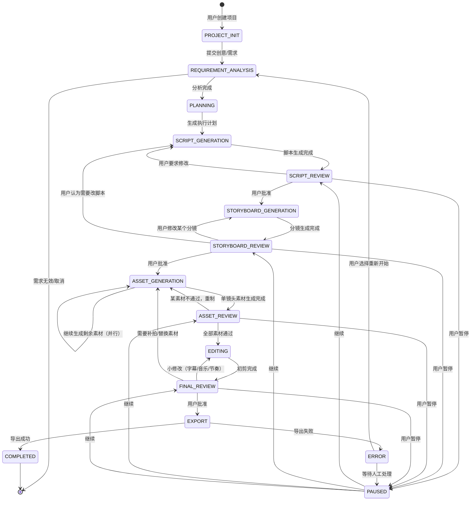

# 项目状态机设计

## 设计原则

- **Agent 自动推进**：非人工节点由系统自动执行
- **人工节点少但关键**：只在脚本、分镜、成片三处强制暂停
- **回滚清晰**：用户在 downstream 发现 upstream 问题时，可直接跳回对应状态
- **暂停通用化**：任何人工节点都可以暂停，恢复后回到原状态

## 状态图（Mermaid）



## 状态说明

| 状态 | 类型 | 说明 |
|---|---|---|
| `PROJECT_INIT` | 自动 | 创建项目，初始化配置 |
| `REQUIREMENT_ANALYSIS` | 自动 | Agent 解析用户意图、产品资料、参考案例 |
| `PLANNING` | 自动 | Agent 制定执行计划（DAG） |
| `SCRIPT_GENERATION` | 自动 | 生成解说词/脚本 |
| `SCRIPT_REVIEW` | **人机回环** | 用户确认或修改脚本 |
| `STORYBOARD_GENERATION` | 自动 | 根据脚本生成画面描述/关键帧 |
| `STORYBOARD_REVIEW` | **人机回环** | 用户确认或修改分镜 |
| `ASSET_GENERATION` | 自动 | 并行生成视频片段、图片、配音 |
| `ASSET_REVIEW` | 可选人机回环 | 自动质检 + 用户抽查 |
| `EDITING` | 自动 | 自动剪辑、加字幕、配乐、合成 |
| `FINAL_REVIEW` | **人机回环** | 用户看初剪，确认或打回 |
| `EXPORT` | 自动 | 渲染最终视频 |
| `COMPLETED` | 终态 | 项目完成 |
| `ERROR` | 异常 | 记录错误，等待处理 |
| `PAUSED` | 暂停 | 用户主动中断 |

## TypeScript 实现

### 类型定义

```typescript
// states.ts
export type State = 
  | 'PROJECT_INIT'
  | 'REQUIREMENT_ANALYSIS'
  | 'PLANNING'
  | 'SCRIPT_GENERATION'
  | 'SCRIPT_REVIEW'
  | 'STORYBOARD_GENERATION'
  | 'STORYBOARD_REVIEW'
  | 'ASSET_GENERATION'
  | 'ASSET_REVIEW'
  | 'EDITING'
  | 'FINAL_REVIEW'
  | 'EXPORT'
  | 'COMPLETED'
  | 'ERROR'
  | 'PAUSED'

export type Event =
  | { type: 'SUBMIT_REQUIREMENT'; payload: RequirementInput }
  | { type: 'ANALYSIS_DONE'; payload: AnalysisResult }
  | { type: 'PLAN_DONE'; payload: Plan }
  | { type: 'SCRIPT_GENERATED'; payload: Script }
  | { type: 'SCRIPT_APPROVED' }
  | { type: 'SCRIPT_REJECTED'; payload: RevisionRequest }
  | { type: 'STORYBOARD_GENERATED'; payload: Storyboard }
  | { type: 'STORYBOARD_APPROVED' }
  | { type: 'STORYBOARD_REJECTED'; payload: RevisionRequest }
  | { type: 'ASSET_BATCH_DONE'; payload: AssetBatch }
  | { type: 'ALL_ASSETS_APPROVED' }
  | { type: 'ASSET_REJECTED'; assetId: string; reason: string }
  | { type: 'EDITING_DONE'; payload: DraftVideo }
  | { type: 'FINAL_APPROVED' }
  | { type: 'FINAL_REJECTED'; payload: RevisionRequest }
  | { type: 'EXPORT_DONE'; payload: ExportedVideo }
  | { type: 'EXPORT_FAILED'; error: string }
  | { type: 'PAUSE' }
  | { type: 'RESUME' }
  | { type: 'RETRY' }
  | { type: 'RESTART' }

export interface ProjectState {
  id: string
  state: State
  context: ProjectContext
  history: StateTransition[]
  createdAt: Date
  updatedAt: Date
}

export interface ProjectContext {
  requirement?: RequirementInput
  analysis?: AnalysisResult
  plan?: Plan
  script?: Script
  storyboard?: Storyboard
  assets?: Asset[]
  draftVideo?: DraftVideo
  exportedVideo?: ExportedVideo
  pausedFrom?: State
  error?: string
}
```

### 转换规则

```typescript
// transitions.ts
export interface Transition {
  from: State
  event: Event['type']
  to: State
  guard?: (state: ProjectState, event: Event) => boolean
  onEnter?: (state: ProjectState, event: Event) => Promise<ProjectContext>
}

export const transitions: Transition[] = [
  { from: 'PROJECT_INIT', event: 'SUBMIT_REQUIREMENT', to: 'REQUIREMENT_ANALYSIS' },
  { from: 'REQUIREMENT_ANALYSIS', event: 'ANALYSIS_DONE', to: 'PLANNING' },
  { from: 'PLANNING', event: 'PLAN_DONE', to: 'SCRIPT_GENERATION' },
  { from: 'SCRIPT_GENERATION', event: 'SCRIPT_GENERATED', to: 'SCRIPT_REVIEW' },
  { from: 'SCRIPT_REVIEW', event: 'SCRIPT_APPROVED', to: 'STORYBOARD_GENERATION' },
  { from: 'SCRIPT_REVIEW', event: 'SCRIPT_REJECTED', to: 'SCRIPT_GENERATION' },
  { from: 'SCRIPT_REVIEW', event: 'PAUSE', to: 'PAUSED' },
  { from: 'STORYBOARD_GENERATION', event: 'STORYBOARD_GENERATED', to: 'STORYBOARD_REVIEW' },
  { from: 'STORYBOARD_REVIEW', event: 'STORYBOARD_APPROVED', to: 'ASSET_GENERATION' },
  { from: 'STORYBOARD_REVIEW', event: 'STORYBOARD_REJECTED', to: 'STORYBOARD_GENERATION' },
  { from: 'STORYBOARD_REVIEW', event: 'SCRIPT_REJECTED', to: 'SCRIPT_GENERATION' },
  { from: 'STORYBOARD_REVIEW', event: 'PAUSE', to: 'PAUSED' },
  { from: 'ASSET_GENERATION', event: 'ASSET_BATCH_DONE', to: 'ASSET_REVIEW' },
  { from: 'ASSET_REVIEW', event: 'ASSET_REJECTED', to: 'ASSET_GENERATION' },
  { from: 'ASSET_REVIEW', event: 'ALL_ASSETS_APPROVED', to: 'EDITING' },
  { from: 'ASSET_REVIEW', event: 'PAUSE', to: 'PAUSED' },
  { from: 'EDITING', event: 'EDITING_DONE', to: 'FINAL_REVIEW' },
  { from: 'FINAL_REVIEW', event: 'FINAL_APPROVED', to: 'EXPORT' },
  { from: 'FINAL_REVIEW', event: 'FINAL_REJECTED', to: 'EDITING' },
  { from: 'FINAL_REVIEW', event: 'PAUSE', to: 'PAUSED' },
  { from: 'EXPORT', event: 'EXPORT_DONE', to: 'COMPLETED' },
  { from: 'EXPORT', event: 'EXPORT_FAILED', to: 'ERROR' },
  { from: 'ERROR', event: 'RETRY', to: 'EXPORT' },
  { from: 'ERROR', event: 'RESTART', to: 'REQUIREMENT_ANALYSIS' },
  { from: 'PAUSED', event: 'RESUME', to: 'SCRIPT_REVIEW', guard: wasReviewingScript },
  { from: 'PAUSED', event: 'RESUME', to: 'STORYBOARD_REVIEW', guard: wasReviewingStoryboard },
  { from: 'PAUSED', event: 'RESUME', to: 'ASSET_REVIEW', guard: wasReviewingAssets },
  { from: 'PAUSED', event: 'RESUME', to: 'FINAL_REVIEW', guard: wasReviewingFinal },
]

const wasReviewingScript = (s: ProjectState) => s.context.pausedFrom === 'SCRIPT_REVIEW'
const wasReviewingStoryboard = (s: ProjectState) => s.context.pausedFrom === 'STORYBOARD_REVIEW'
const wasReviewingAssets = (s: ProjectState) => s.context.pausedFrom === 'ASSET_REVIEW'
const wasReviewingFinal = (s: ProjectState) => s.context.pausedFrom === 'FINAL_REVIEW'
```

### 状态处理器

```typescript
// handlers.ts
export const stateHandlers: Record<State, (project: ProjectState) => Promise<Event>> = {
  REQUIREMENT_ANALYSIS: async (project) => {
    const analysis = await agent.analyzeRequirement(project.context.requirement!)
    return { type: 'ANALYSIS_DONE', payload: analysis }
  },

  PLANNING: async (project) => {
    const plan = await agent.createPlan(project.context)
    return { type: 'PLAN_DONE', payload: plan }
  },

  SCRIPT_GENERATION: async (project) => {
    const script = await agent.generateScript(project.context)
    return { type: 'SCRIPT_GENERATED', payload: script }
  },

  STORYBOARD_GENERATION: async (project) => {
    const storyboard = await agent.generateStoryboard(project.context)
    return { type: 'STORYBOARD_GENERATED', payload: storyboard }
  },

  ASSET_GENERATION: async (project) => {
    const pendingAssets = project.context.storyboard!.shots.filter(s => !s.assetId)
    const batchSize = 3 // 根据 GPU 显存调整
    const assets: Asset[] = []

    for (const batch of chunk(pendingAssets, batchSize)) {
      const results = await Promise.all(batch.map(shot => assetService.generate(shot)))
      assets.push(...results)
    }

    return { type: 'ASSET_BATCH_DONE', payload: { assets } }
  },

  ASSET_REVIEW: async (project) => {
    const results = await qualityCheck.run(project.context.assets!)
    const rejected = results.find(r => !r.passed)

    if (rejected) {
      return {
        type: 'ASSET_REJECTED',
        assetId: rejected.assetId,
        reason: rejected.reason
      }
    }

    return { type: 'ALL_ASSETS_APPROVED' }
  },

  EDITING: async (project) => {
    const draft = await editor.compose(project.context)
    return { type: 'EDITING_DONE', payload: draft }
  },

  EXPORT: async (project) => {
    try {
      const video = await exporter.render(project.context.draftVideo!)
      return { type: 'EXPORT_DONE', payload: video }
    } catch (error) {
      return { type: 'EXPORT_FAILED', error: String(error) }
    }
  },

  // 人工状态：等待用户事件
  PROJECT_INIT: async () => { throw new Error('Manual state') },
  SCRIPT_REVIEW: async () => { throw new Error('Manual state') },
  STORYBOARD_REVIEW: async () => { throw new Error('Manual state') },
  FINAL_REVIEW: async () => { throw new Error('Manual state') },
  PAUSED: async () => { throw new Error('Manual state') },
  ERROR: async () => { throw new Error('Manual state') },
  COMPLETED: async () => { throw new Error('Terminal state') },
}
```

### 运行器

```typescript
// runner.ts
const manualStates: State[] = [
  'PROJECT_INIT', 'SCRIPT_REVIEW', 'STORYBOARD_REVIEW',
  'FINAL_REVIEW', 'PAUSED', 'ERROR'
]

const terminalStates: State[] = ['COMPLETED']

export class ProjectRunner {
  async process(projectId: string) {
    let project = await db.getProject(projectId)

    while (!terminalStates.includes(project.state)) {
      if (manualStates.includes(project.state)) {
        return { status: 'waiting_for_human', state: project.state }
      }

      const handler = stateHandlers[project.state]
      const event = await handler(project)
      project = await this.transition(project, event)
      await db.saveProject(project)
    }

    return { status: 'completed', state: project.state }
  }

  private async transition(project: ProjectState, event: Event): Promise<ProjectState> {
    const transition = transitions.find(
      t => t.from === project.state
        && t.event === event.type
        && (!t.guard || t.guard(project, event))
    )

    if (!transition) {
      throw new Error(`Invalid transition: ${project.state} + ${event.type}`)
    }

    const newContext = transition.onEnter
      ? await transition.onEnter(project, event)
      : mergeContext(project.context, event)

    return {
      ...project,
      state: transition.to,
      context: newContext,
      history: [
        ...project.history,
        { from: project.state, to: transition.to, event, at: new Date() }
      ],
      updatedAt: new Date()
    }
  }
}
```

## 关键细节

### 1. 暂停与恢复

进入 `PAUSED` 时保存来源状态：

```typescript
const newContext = {
  ...project.context,
  pausedFrom: project.state
}
```

### 2. 并行生成控制

`ASSET_GENERATION` 按 GPU 显存分批并行，避免 OOM：

```typescript
const batchSize = 3
for (const batch of chunk(pendingAssets, batchSize)) {
  await Promise.all(batch.map(shot => generateAsset(shot)))
}
```

### 3. 失败重试

```typescript
const retryPolicy = {
  maxRetries: 3,
  backoff: 'exponential',
  retryableErrors: ['RATE_LIMIT', 'GPU_OOM', 'MODEL_TIMEOUT']
}
```

### 4. 回滚语义

- `STORYBOARD_REVIEW` → `SCRIPT_GENERATION`：用户发现脚本方向错误，从脚本重做
- `FINAL_REVIEW` → `ASSET_GENERATION`：需要补拍某个镜头
- `FINAL_REVIEW` → `EDITING`：只调整字幕、音乐、节奏
